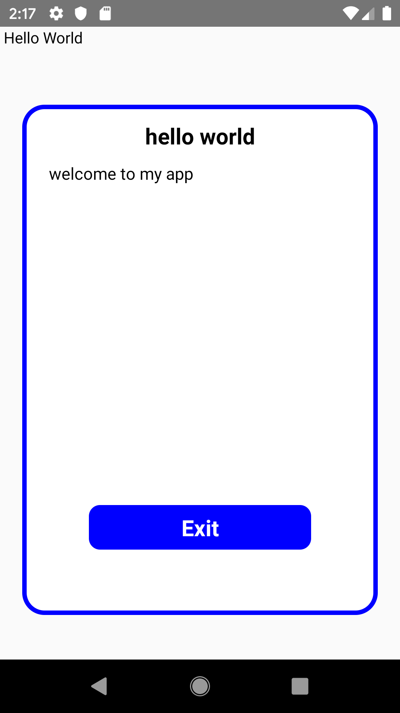

The First Access component of this simple project is in:

- src > FirstAccess;

What this does ? This is the component that will pop up in the first access of the client
in the page that mount the component.

Why shows only once ? Because the asyncstorage is set, so it will save the information and won't
forget it, making the state static.

When to use this ? When the application needs some screen or modal that in the first access gives some
advices, some term or even some tips on how to use the features.

Note that in order to give the modal title and description, it needs to add the props title and description.

------- You can not use the component as the first thing that shows in the render. It needs to be called after the component be mounted. Otherwise, will show a error - 
"the bind value at index 1 is null react native"

Now, just import the component in where you need it, and put it inside a View like the example:

-- -- <View>
  <FirstAccess title={'myTitle'} description={'myDescription'} />
</View> -- 

This is how should looks like:

  

--<View>
  <FirstAccess title={'myTitle'} description={'myDescription'} />
</View> --

NOTE - if you need to see the modal one more time, you can clean the storage going in the application info and selecting - clear storage.
REMINDE that you need to put the component inside of a View component so it will work.
